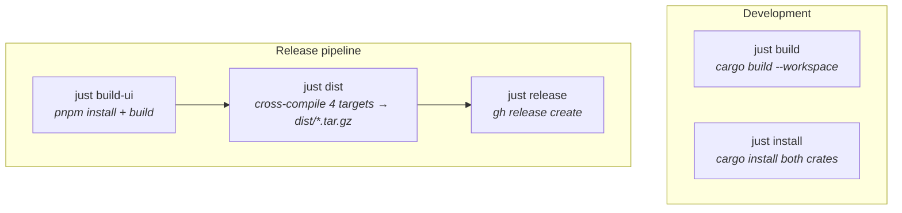
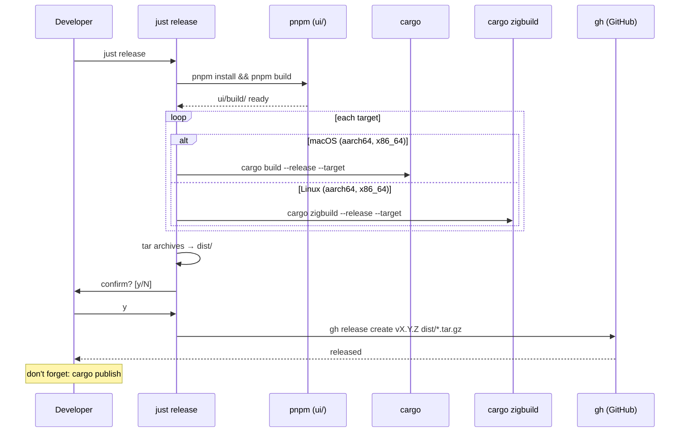

# Building & Releasing

## Which command do I run?

**Developing locally?** `just build`
**Ready to release?** `just release`

## Commands

| Command | When to use | What it does |
|---|---|---|
| `just build` | Day-to-day development | `cargo build --workspace` (debug) |
| `just install` | Test the installed binary | `cargo install` both cli + daemon |
| `just release` | Ship a new version | Builds UI, cross-compiles all targets, creates GitHub release |

### Intermediate commands

You probably don't need to run these directly — `just release` chains them automatically.

| Command | What it does |
|---|---|
| `just build-ui` | `pnpm install && pnpm build` in `ui/` |
| `just build-release` | `cargo build --workspace --release` (native target only) |
| `just build-all` | `build-ui` + `build-release` (native target only) |
| `just dist` | `build-ui` + cross-compile all 4 targets, package into `dist/` |

### Release flow

### Cross-compilation targets

| Target | Build tool |
|---|---|
| `aarch64-apple-darwin` | cargo |
| `x86_64-apple-darwin` | cargo |
| `aarch64-unknown-linux-musl` | cargo-zigbuild |
| `x86_64-unknown-linux-musl` | cargo-zigbuild |
